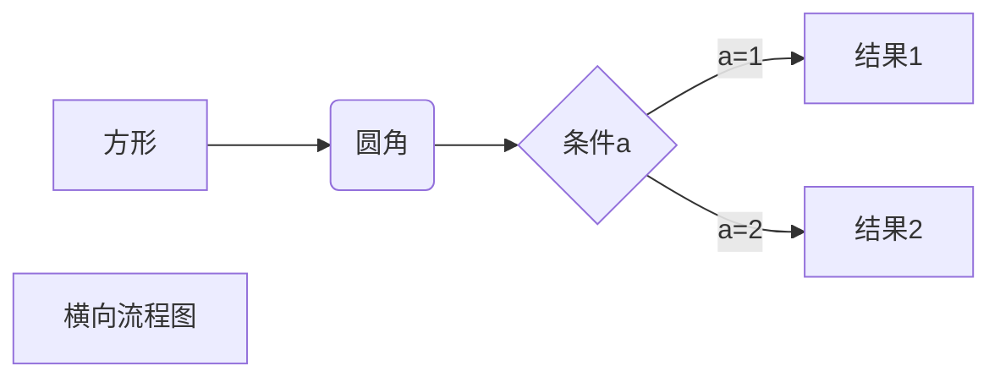

# 一本Markdown的指导书

###### KitayamaAsuna


 本文基于Typora进行书写，不同编辑器下的Markdown语法或有不同，还请自行尝试


### Markdown标题

你可以使用#来表示标题，一号标题就在前面加一个#，二号就是两个，最多可以加六个

需要注意符号与文字之间有空格才可以生效

像上方的就是三号标题

它的代码是

```### Markdown标题    
### Markdown标题
```


### Markdown字体

使用*和_包围文本实现斜体

```
*就像这样*	和	_这样_
```

*就像这样* 	和	 _这样_

同样的，用**和__

***和___

会有如下效果

**这个是两个星号的粗体**

***这个是三个星号的粗斜体***

由于在中文输入法下打出_比较麻烦推荐使用*


另外，如果你想要分割线，只需要在一行中使用三个以上的*或-即可

``` 
******************
```

**************************


使用删除线的方法则是在文字两边分别加两个~~

```
~~我被删除了~~
```

~~我被删除了~~


下划线需要通过HTML来完成

```
<u>我被下划了</u>
```

<u>我被下划了</u>


Markdown也支持添加注释

```
试着把鼠标放到我这里[^试着把鼠标放到我这里]
[^试着把鼠标放到我这里]:是不是非常神奇？
```

试着把鼠标放到我这里[^试着把鼠标放到我这里]

[^试着把鼠标放到我这里]:是不是非常神奇？


### Markdown列表

与HTML类似Markdown也有有序列表和无序列表

```
* 文字前加*或+或-来作为列表标记
+ 同样的
- 需要加空格才能生效
```

* 文字前加*或+或-来作为列表标记
+ 同样的

- 需要加空格才能生效

   ```
   1. 如果要用有序列表那么只需用数字加上.
   2. 还是很直观的哈
   3. 同样的别忘了空格
   ```

1. 如果要用有序列表那么只需用数字加上.
2. 还是很直观的哈
3. 同样的别忘了空格


如果你需要列表嵌套

   ```
   1. 那么
   	- 只需要在字列表前按tab就可以了
   ```

1. 那么
	- 只需要在字列表前按tab就可以了

​    

### Markdown区块

在段落开头用>来表示区块引用

```
> 就像这样，和我说过好多遍的空格
```

> 就像这样，和我说过好多遍的空格


甚至区块也可以嵌套

```
> 真让人惊讶
>> 在引用里面引用
>>> 不过话说回来为什么不能直接引用最里层的人呢
```

> 真让人惊讶
> > 在引用里面引用
> >
> > > 不过话说回来为什么不能直接引用最里层的人呢


如果你足够变态，也可以在区块里加列表

```
> 1. 就像这样
>> + 或者这样
>>> * 还有这样
```

> 1. 就像这样
> > + 或者这样
> >
> > > * 还有这样


反过来也是可以的哦

```
* 现在是列表里套区块
	> 我是区块
```

* 现在是列表里套区块
	
	> 我是区块


### Markdown代码

对于程序员来说有时候文章中也会出现代码

```
这时就要用到反单引号啦，要注意它只能在英文输入法下出现。`在你左侧tab键上方`
```

这时就要用到反单引号啦，要注意它只能在英文输入法下出现。`在你左侧tab键上方`


如果你也想像我一样使用代码区块

```
那就不得不使用三个`啦，在Typora中只需要在段首打出```就会出现代码区块了
``` 需要注意的是回车后才能在代码区块中输入，所以这句话不会出现
```

那就不得不使用三个`啦，在Typora中只需要在段首打出```就会出现代码区块了

``` 就像这样
```

同时在回车后你也可以指定一种语言，它可以高亮你的代码

```c++
#include <iostream>
using namespace;
int main()
{
    cout<<"Hello World!"<<endl;
    return 0;
}
```


### Markdown链接

使用中括号包裹名称，小括号包裹地址

或者直接使用<>

```
比方说你可以[访问我的主页](https://github.com/LinsMik)
也可以点这个<https://github.com/LinsMik>
```

比方说你可以[访问我的主页](https://github.com/LinsMik)
也可以点这个<https://github.com/LinsMik>


高级一些还能设置高级链接

```
有点像注释一样可以在文章后面找到[我的Github主页][Github]
[Github]:https://github.com/LinsMik
```

有点像注释一样可以在文章末尾找到[我的Github主页][Github]

[Github]:https://github.com/LinsMik


### Markdown图片

感叹号 !开头

方括号中写图片的替换文本

小括号里写地址

```
[](https://imgtu.com/i/fIKMW9)
```

[](https://imgtu.com/i/fIKMW9)


也可以用高级链接来链接图片

```
[图片][pic]
[pic]:https://z3.ax1x.com/2021/08/17/fIKMW9.png
```

[图片][pic]

[pic]:https://z3.ax1x.com/2021/08/17/fIKMW9.png


当然你也可以用HTML来设置

要知道Markdown是相当一部分HTML标签的


### Markdown表格

用|分列，-来分行

```
|1|2|3|
|--|--|--|
|4|5|6|

```

| 1    | 2    | 3    |
| ---- | ---- | ---- |
| 4    | 5    | 6    |

-:右对齐

:-左对齐

:-:中间对齐

```
|我左对齐|我右对齐|我中间对齐|
|:-|-:|:-:|
|俺也一样|俺也一样|俺也一样|
```

| 我左对齐 | 我右对齐 | 我中间对齐 |
| :------- | -------: | :--------: |
| 俺也一样 | 俺也一样 |  俺也一样  |


### Markdown高级技巧

像上文说过的可以在Markdown里写HTML标签

目前支持

```
<kbd><b><i><em><sup><sub><br>等标签
```

你可以尝试更多的标签


使用转义字符\来防止符号被解析

```
\*\*就像在别的语言里一样的使用方法\*\*
```

\*\*就像在别的语言里一样的使用方法\*\*


当你需要在编辑器中插入数学公式时，可以使用两个美元符 $$ 包裹 TeX 或 LaTeX 格式的数学公式来实现。提交后，问答和文章页会根据需要加载 Mathjax 对数学公式进行渲染。如：

```
$$
\mathbf{V}_1 \times \mathbf{V}_2 =  \begin{vmatrix} 
\mathbf{i} & \mathbf{j} & \mathbf{k} \\
\frac{\partial X}{\partial u} &  \frac{\partial Y}{\partial u} & 0 \\
\frac{\partial X}{\partial v} &  \frac{\partial Y}{\partial v} & 0 \\
\end{vmatrix}
${$tep1}{\style{visibility:hidden}{(x+1)(x+1)}}
$$
```

$$
\mathbf{V}_1 \times \mathbf{V}_2 =  \begin{vmatrix} 
\mathbf{i} & \mathbf{j} & \mathbf{k} \\
\frac{\partial X}{\partial u} &  \frac{\partial Y}{\partial u} & 0 \\
\frac{\partial X}{\partial v} &  \frac{\partial Y}{\partial v} & 0 \\
\end{vmatrix}
${$tep1}{\style{visibility:hidden}{(x+1)(x+1)}}
$$


用Markdown画图

````

````


需要注意的是要在语言的地方选择mermaid才能渲染出来

其他的图也是同理


### 后记

​        本文受我的舍友David Xin启发，来源于之前的某天他跟我说每次打印时都需要将word转成pdf防止在不同电脑上排版不同的问题。而Markdown基本上就是为了解决这类问题而生的。它在任何设备上都是同样的状态，正如你所想设置的一样。

​         对比HTML(Hypertext Mark**up** Language)，Mark**down**是反标记的。它的本质是专注文章的内容而不是样式，为此它不提供更改颜色的方式，甚至就连大小都是很模糊的，字体也只有黑体一种。对于内容创作者来说，一个好的排版固然很好，但最重要的永远是内容。Markdown的设计减轻了对于细枝末节的思考负担，让使用者可以把精力全部放在自己的内容上。

​        希望大家可以利用Markdown更好的帮助自己的工作和生活。

​																																记于2021/8/18  0:13

​		

